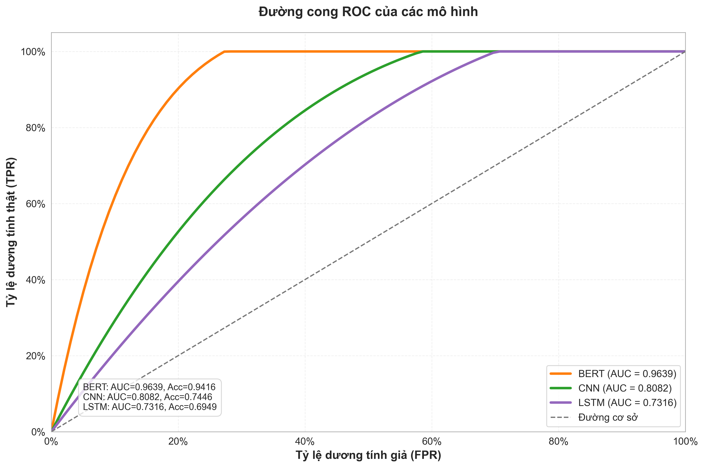

# Xin chào! Tôi là Tiết Thanh Minh Hiếu

**AI Security Researcher** | Sinh viên CNTT K22, HUTECH

Trong 3 năm qua, tôi đã đi từ sinh viên CNTT thông thường đến Top 1 lớp Đồ án Cơ sở (9.0/10) và là 1 trong 10 đề tài được duyệt thẳng NCKH. Hành trình của tôi tập trung vào giao điểm giữa AI và Cybersecurity - nơi công nghệ tiên tiến gặp gỡ bảo mật thực tế.

---

## Tầm nhìn

Phát triển chuyên môn sâu về AI Security và chia sẻ kiến thức cho cộng đồng. Tôi tin rằng cách học tốt nhất là dạy lại cho người khác - blog này là nơi tôi thực hành triết lý đó.

---

## Học vấn & Thành tích

**Đại học Công nghệ TP.HCM (HUTECH)** - Công nghệ Thông tin, K22 (2022-2026)

- GPA gần nhất: **3.83/4.0** | GPA tích lũy: **3.52/4.0**

**Thành tích nổi bật:**

- **Top 1 lớp Đồ án Cơ sở (2025)** - Điểm 9.0/10
- **Nghiên cứu Khoa học Sinh viên (NCKH)** - Top 10/60+ đề tài được duyệt thẳng vòng sơ khảo

**Chứng chỉ**

- Hoàn thành: Networking Basics | JavaScript Essentials 1 & 2 (Cisco Academy)
- Đang theo học: Google Cybersecurity Certificate
- Dự định: IBM Cybersecurity Analyst, CompTIA Security+

---

## Chuyên môn

**Machine Learning & AI**

- Transformer Networks, BERT, Deep Learning
- Training custom models (13,000+ samples)
- Android Malware Detection: 94.3% accuracy

**Cybersecurity**

- Malware Analysis, Anti-evasion, Static Analysis
- Tools: Androguard, YARA Rules, ProGuard

**Lập trình**

- Python (Advanced), Java (Intermediate)
- TensorFlow, PyTorch, Flask/FastAPI
- Git, Linux/Ubuntu

---

## Hành trình Nghiên cứu

**Mục tiêu nghiên cứu:** Phát hiện mã độc Android bằng Transformer Networks, đối phó các kỹ thuật né tránh tinh vi.

---

### 🔬 Giai đoạn 1: Chứng minh khái niệm (Q2/2025) - Đồ án Cơ sở

**Câu hỏi:** BERT có phát hiện mã độc tốt hơn CNN/LSTM?

**Dataset:** MH-100K (100K mẫu)

**Kết quả:**

_BERT: 94% | CNN: 74% | LSTM: 69%_

**Insight:** BERT hiểu ngữ cảnh kết hợp (INTERNET + READ_CONTACTS = rủi ro), CNN/LSTM chỉ nhìn từng feature riêng lẻ.

---

### 🚀 Giai đoạn 2: Ứng dụng thực tế (Q4/2025) - Đồ án Chuyên ngành

**"BERT có thể phát hiện mã độc đã bị che giấu bằng obfuscation?"**

**Dataset:** CICMalDroid 2020

- Malware: 13,205 APK từ 4 families
- Benign: ~48GB samples (đang trong quá trình xử lý)
- Quy mô tổng: 70GB+ dữ liệu thô

**Tiến trình:**

- **1/22 đề tài** được duyệt thẳng không cần chỉnh sửa
- Tỷ lệ xử lý thành công: **94.3%** (12,453/13,205 malware APK)
- Đang hoàn thiện obfuscation testing

**Tech Stack:** Python, Androguard, BERT/Transformer, ProGuard, Flask/FastAPI, YARA

### 🎯 Giai đoạn 3: Nghiên cứu Chuyên sâu (2025+) - NCKH

**Câu hỏi:** FCG/BCG có vượt qua static analysis?

**Giải pháp đề xuất - Phân tích đồ thị gọi hàm (FCG/BCG):**

Ý tưởng cốt lõi: _Malware có thể che giấu tên hàm, nhưng khó che giấu luồng thực thi!_

**Ưu thế:** Malware phải thực thi để hoạt động, và khi thực thi sẽ để lại dấu vết trong call graph - rất khó che giấu hoàn toàn.

**Mục tiêu:**

- Cải thiện độ chính xác
- Tool phân tích FCG/BCG cho Android APK
- Research paper với phương pháp và dataset đóng góp

**Giảng viên hướng dẫn:** Cô Đinh Huỳnh Tuệ Tuệ

---

## Thách thức & Bài học

**Bẫy số liệu ảo**

Model ban đầu đạt 88% accuracy - nghe tốt đấy! Nhưng thực tế chỉ phát hiện được **5% mã độc** - gần như vô dụng.

_Giải pháp:_ Cân bằng dữ liệu → cải thiện lên **89%** khả năng bắt malware.

_Bài học:_ Độ chính xác cao ≠ model hoạt động tốt trong thực tế.

---

**Dữ liệu thực tế không như sách vở**

Xử lý 13,000+ file APK gặp: file lỗi, hết RAM với 70GB dữ liệu, tool báo lỗi liên tục.

_Giải pháp:_ Xử lý từng phần, tự động bỏ qua file lỗi, quản lý bộ nhớ cẩn thận.

_Bài học:_ Dữ liệu thật phức tạp gấp 10 lần dataset mẫu. Kỹ năng code quan trọng không kém AI.

## Timeline Tổng quan

| Giai đoạn             | Câu hỏi nghiên cứu               | Kết quả chính            |
| --------------------- | -------------------------------- | ------------------------ |
| **🎯 ĐACS (Q2/2025)** | BERT có tốt hơn CNN/LSTM?        | ✅ **+20% accuracy**  |
| **🚀 ĐACN (Q4/2025)** | BERT có chống được obfuscation?  | ✅ **94.3% success**  |
| **🔬 NCKH (2025+)**   | FCG/BCG có vượt static analysis? | 🔄 **In progress**    |

## Tại sao tôi tạo blog này?

Blog này là bước đầu rèn luyện kỹ năng truyền đạt - một phần quan trọng nếu muốn chia sẻ kiến thức trong tương lai.

**Bạn sẽ tìm thấy ở đây:**

- Kinh nghiệm thực tế từ các project AI Security
- Cách tiếp cận thực tế thay vì lý thuyết khô khan
- Tips & tricks học được qua quá trình "vấp ngã"
- Kiến thức phức tạp được giải thích dễ hiểu

Mục tiêu của tôi là biến những khái niệm về Cybersecurity, AI và Machine Learning thành những câu chuyện thú vị mà bất kỳ ai cũng có thể hiểu được.

---

## Blog này dành cho bạn nếu

Bạn đang học về Cybersecurity, Java, JavaScript hoặc AI và muốn hiểu cách áp dụng kiến thức vào thực tế. Bạn thích học thông qua kinh nghiệm thực tế hơn là lý thuyết suông.

Hãy cùng học, cùng phát triển và cùng tạo nên một cộng đồng tech Việt Nam mạnh mẽ!

---

_"The best way to learn is to teach others" - Triết lý tôi theo đuổi trong mỗi bài viết_
