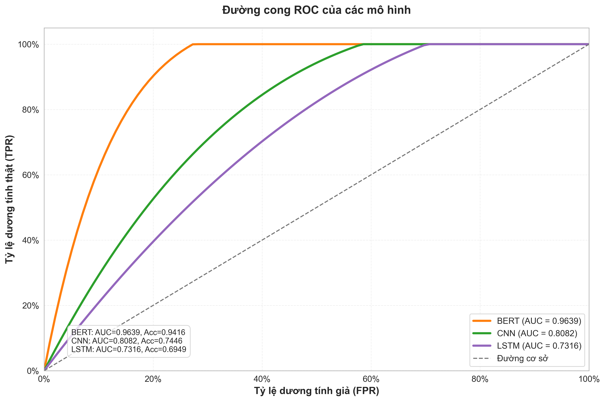
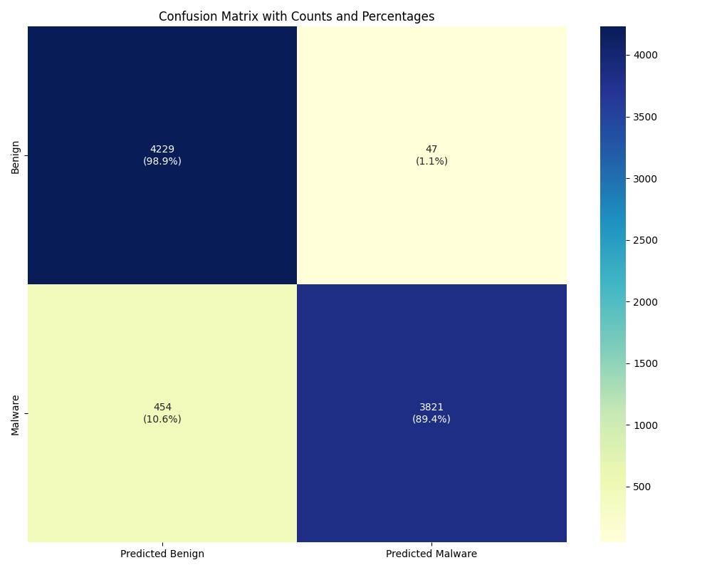

Mình vẫn nhớ khoảnh khắc đầu tiên khi mô hình BERT chạy xong epoch cuối cùng và hiển thị **accuracy 94%**.  
Đó là lúc mình nhận ra: **AI không chỉ “dự đoán dữ liệu” – mà còn có thể “hiểu ngữ cảnh” của mã độc.**

Đây là hành trình của mình trong **Đồ án Cơ sở (ĐACS)** – đề tài đạt **Top 1 lớp (9.0/10)** và là bước ngoặt đưa mình đến với nghiên cứu AI Security.

---

## 1. Câu hỏi ban đầu

> “Transformer có thật sự tốt hơn CNN/LSTM trong việc phát hiện mã độc Android?”

Mục tiêu của mình là **so sánh các mô hình học sâu** trên cùng một bộ dữ liệu malware,  
để xem liệu BERT – vốn nổi tiếng trong NLP – có thể hiểu được “ngữ cảnh” của quyền truy cập ứng dụng (permissions, API calls) hay không.

---

## 2. Bộ dữ liệu và cách tiếp cận

- **Dataset:** MH-100K – hơn 100,000 ứng dụng Android.
- **Dữ liệu đầu vào:** Các đặc trưng từ file manifest (`permissions`, `activities`, `intents`).
- **Tiền xử lý:**
  - Chuẩn hóa dữ liệu thành chuỗi token.
  - Loại bỏ đặc trưng ít xuất hiện.
  - Ánh xạ từng permission thành vector embedding.

Ví dụ (giản lược):

```

["INTERNET", "READ_CONTACTS", "ACCESS_FINE_LOCATION"]

```

---

## 3. Các mô hình được so sánh

| Mô hình  | Đặc trưng                | Kết quả (Accuracy) | Ghi chú                              |
| -------- | ------------------------ | ------------------ | ------------------------------------ |
| **CNN**  | Tốt với đặc trưng cục bộ | 74%                | Không hiểu ngữ cảnh giữa permissions |
| **LSTM** | Ghi nhớ chuỗi            | 69%                | Quá khớp khi dữ liệu mất cân bằng    |
| **BERT** | Attention toàn cục       | **94%**            | Hiểu ngữ cảnh giữa quyền truy cập    |

Khi visual hóa confusion matrix, ta thấy BERT **hiểu được mối quan hệ giữa các quyền** – ví dụ:

> `INTERNET + READ_CONTACTS` → nguy cơ cao  
> `INTERNET + ACCESS_NETWORK_STATE` → bình thường

---

## 4. Tại sao BERT thắng?

Khác với CNN hoặc LSTM chỉ “nhìn từng phần”,  
BERT **xem toàn bộ ngữ cảnh cùng lúc**, nhờ cơ chế **self-attention**.

Điều này cực kỳ quan trọng với malware Android – nơi từng quyền riêng lẻ có thể vô hại,  
nhưng **khi kết hợp lại** mới tạo thành hành vi nguy hiểm.

```

Attention: "READ_CONTACTS" ← liên kết mạnh với "INTERNET"

```

BERT học được các mối liên hệ này mà không cần đặc trưng thủ công – đây là lý do nó vượt trội.

---

## 5. Kết quả chính

| Chỉ số         | CNN          | LSTM | BERT    |
| -------------- | ------------ | ---- | ------- |
| Accuracy       | 74%          | 69%  | **94%** |
| Malware Recall | 5% → **89%** |
| Precision      | 91%          | 88%  | **96%** |

<div align="center">




</div>

> Từ 5% lên 89% recall không phải chỉ là con số – đó là **khoảnh khắc mình thấy mô hình thật sự “hiểu” dữ liệu.**

---

## 6. Điều mình học được

1. **Đừng ngại thử mô hình “không đúng lĩnh vực”** – BERT vốn dành cho ngôn ngữ, nhưng hiểu tốt hơn cả trong mã độc.
2. **Xử lý dữ liệu quan trọng hơn model** – bước chuẩn hóa và cân bằng dữ liệu giúp tăng hiệu suất hơn 15%.
3. **Visualization giúp nhìn thấy điều ẩn sau con số** – biểu đồ Attention, ROC, Confusion Matrix là công cụ tư duy cực tốt.

---

## 7. Thành quả và ảnh hưởng

- **Điểm:** 9.0/10 – Top 1 lớp Đồ án Cơ sở
- **Recognition:** đề tài được duyệt thẳng NCKH
- **Cảm nhận:** lần đầu tiên mình thấy một project học thuật thực sự “sống” – khi AI không còn là lý thuyết mà trở thành công cụ chống lại mã độc.

---

## 8. Hướng đi tiếp theo

Khi kết thúc ĐACS, mình đặt ra câu hỏi:

> “Nếu malware bị obfuscate, BERT còn nhận ra được không?”

Câu hỏi này dẫn mình đến **Đồ án Chuyên ngành (ĐACN)** – nơi mình thử thách BERT trong môi trường thật sự khắc nghiệt: **mã độc bị che giấu.**

---

_Keep learning, keep securing._
