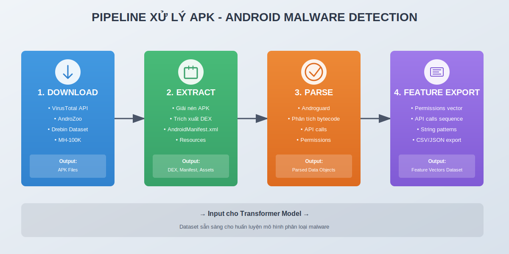
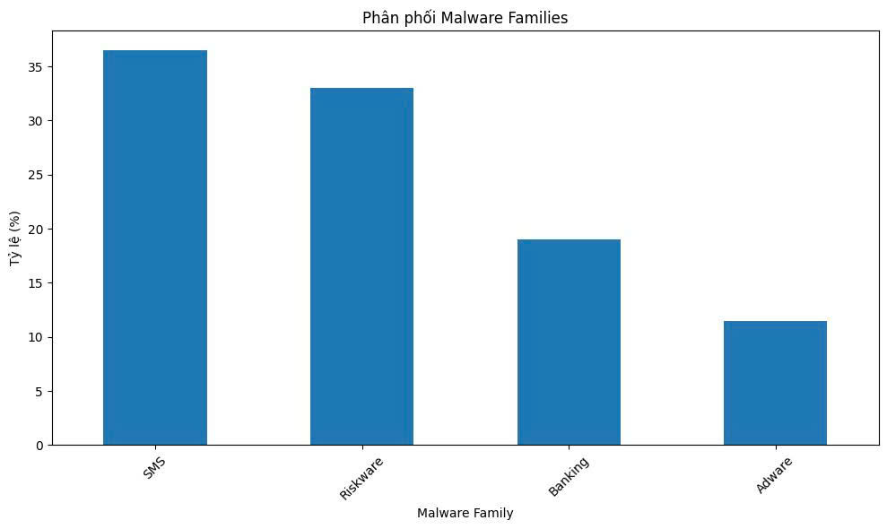
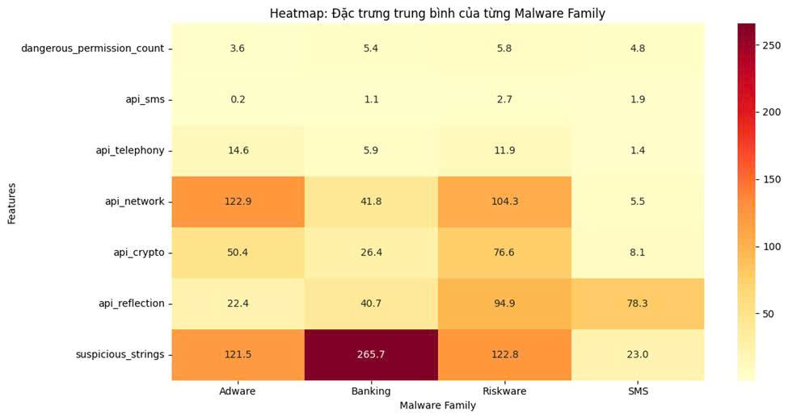

Sau khi kết thúc Đồ án Cơ sở với câu hỏi _“BERT có thật sự hiểu mã độc tốt hơn CNN/LSTM?”_, mình bước vào một thử thách lớn hơn:

> **“Nếu mã độc bị che giấu bằng obfuscation, liệu BERT còn nhận ra được không?”**

Đó chính là mục tiêu của **Đồ án Chuyên ngành (ĐACN)** – giai đoạn tiếp theo trong hành trình nghiên cứu AI Security của mình.

---

## 1. Bối cảnh: Obfuscation – Khi mã độc biết ngụy trang

Obfuscation là kỹ thuật “làm rối” mã nguồn hoặc bytecode để tránh bị phát hiện.  
Ví dụ: thay đổi tên biến, mã hóa chuỗi, hoặc gọi hàm gián tiếp bằng reflection.

Điều này khiến **các hệ thống phát hiện tĩnh** trở nên vô dụng, vì chúng chỉ nhìn “hình thức”, không hiểu “ngữ cảnh”.

Mình đặt mục tiêu:

> Dùng Transformer – mô hình hiểu ngữ cảnh – để “nhìn xuyên qua lớp ngụy trang” này.

---

## 2. Dữ liệu: CICMalDroid 2020 – Bộ dữ liệu thực chiến

Đây là một trong những bộ dữ liệu Android malware được sử dụng trong nghiên cứu học thuật.

- **Tổng số mẫu:** 13,205 APK
- **Phân loại:** SMS, Adware, Banking, Riskware
- **Kích thước:** ~70GB
- **Môi trường phân tích:** Ubuntu 22.04 + Python 3.10
- **Công cụ:** Androguard, ProGuard, Pandas

Mục tiêu đầu tiên: **tự động hóa hoàn toàn pipeline trích xuất đặc trưng** từ 13,000+ file APK – một khối lượng mà nếu làm thủ công, sẽ mất hàng tuần.

<div align="center">



_Minh họa: pipeline tự động gồm 4 bước chính – Download → Extract → Parse → Feature Export_

</div>

---

## 3. Xây dựng pipeline trích xuất đặc trưng

Pipeline của mình gồm 4 giai đoạn chính:

```

Download → Extract → Parse → Feature Export (CSV)

```

Chi tiết:

1. **Tải và kiểm tra dữ liệu**

   - Tự động đọc từng file `.apk` từ thư mục dataset.
   - Xác định tên mẫu, loại malware, kích thước.

2. **Phân tích tĩnh bằng Androguard**

   - Trích xuất Manifest: `permissions`, `activities`, `services`.
   - Trích xuất API calls: `telephony`, `sms`, `reflection`, `crypto`, `dynamic_code`, `network`.

3. **Xử lý lỗi tự động**

   - Ghi log những file lỗi (crash, timeout).
   - Bỏ qua mẫu hỏng để pipeline không dừng giữa chừng.

4. **Tổng hợp & xuất CSV**
   - Xuất thành bảng đặc trưng: **28 cột** (permissions, API, cấu trúc code).
   - Gộp thành hơn **369,000 cells dữ liệu sạch**.

Kết quả: **12,511/13,205 mẫu (94.7%)** trích xuất thành công.

---

## 4. Thống kê và insight thú vị

| Loại malware | Tỷ lệ (%) | Đặc trưng nổi bật                          |
| ------------ | --------- | ------------------------------------------ |
| **SMS**      | 36%       | `api_sms`, `api_telephony`                 |
| **Riskware** | 33%       | Quyền cao, nhiều component                 |
| **Banking**  | 19%       | `api_reflection`, `crypto`, `dynamic_code` |
| **Adware**   | 11%       | `api_network`, `api_telephony`             |

<div align="center">



_Hình: Phân bố tỷ lệ 4 họ malware trong bộ dữ liệu CICMalDroid 2020._

</div>

Một điểm thú vị là nhóm **Banking malware** có xu hướng dùng **Reflection API** –  
đây là kỹ thuật thường được dùng để **ẩn hành vi thật** hoặc **tải code động**.  
Nói cách khác, **Reflection = dấu hiệu obfuscation.**

<div align="center">



_Hình: Heatmap thể hiện tần suất xuất hiện của các nhóm API nổi bật giữa các họ malware._

</div>

---

## 5. Những vấn đề thực tế khi xử lý 70GB dữ liệu

Không có project nào suôn sẻ từ đầu đến cuối – và đồ án này cũng vậy.

- **Lỗi tràn bộ nhớ:** Một số mẫu APK lớn >100MB khiến Androguard crash giữa chừng.
- **Lỗi API cũ:** Các bản mới của Androguard thay đổi cách parse class.
- **Thời gian xử lý:** Mỗi file trung bình 15–20 giây → hơn 10 tiếng xử lý liên tục.

Đây chính là “câu chuyện 10 tiếng” mà mình sẽ kể trong bài kế tiếp — nơi pipeline tưởng chừng đơn giản,  
nhưng lại khiến mình mất nguyên một buổi debug chỉ vì một chi tiết nhỏ.

---

## 6. Kết quả bước đầu

Sau khi xử lý và tổng hợp dữ liệu, mình thu được:

| Hạng mục              | Số lượng | Ghi chú                         |
| --------------------- | -------- | ------------------------------- |
| APK hợp lệ            | 13,205   | Toàn bộ dataset CICMalDroid2020 |
| Trích xuất thành công | 12,511   | 94.7%                           |
| Đặc trưng thống kê    | 28       | API, permission, cấu trúc code  |
| Thời gian trung bình  | ~17s/mẫu | Tổng cộng hơn 10 tiếng          |
| Kích thước CSV        | ~20MB    | 369,000+ cells dữ liệu          |

Tập dữ liệu này hiện đã **sẵn sàng cho huấn luyện Transformer**,  
để kiểm chứng khả năng phát hiện mã độc đã bị che giấu.

---

## 7. Hướng phát triển tiếp theo

1. **Huấn luyện mô hình BERT base** trên tập đặc trưng trích xuất.
2. **Tạo biến thể obfuscation** bằng ProGuard để thử thách mô hình.
3. **So sánh** với các phương pháp baseline (Random Forest, CNN).
4. **Phân tích attention** để xem mô hình “tập trung” vào phần nào của mã độc.

---

## 8. Kết luận

Giai đoạn trích xuất đặc trưng có vẻ đơn giản, nhưng thực tế chính là **nền tảng cho toàn bộ mô hình hoạt động chính xác**. Nếu dữ liệu sai, dù model mạnh đến đâu cũng vô nghĩa.

Mình tin rằng những gì học được từ quá trình này – từ việc xử lý lỗi, hiểu dữ liệu, đến tự động hóa pipeline – sẽ là hành trang quý giá khi bước sâu hơn vào nghiên cứu AI Security sau này.

---

_Keep learning, keep securing._
