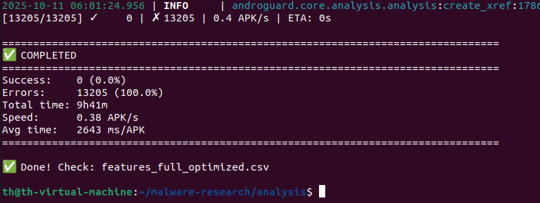

Buổi sáng hôm đó, mình khởi động pipeline với tâm thế tự tin: 13,205 file APK, Androguard script mới tối ưu, hệ thống log sạch sẽ.

Mọi thứ đều hoàn hảo… cho đến khi mình nhìn thấy dòng cuối cùng:

<div align="center">



_Hình: Lần chạy đầu tiên – 13,205 mẫu thất bại, 0% thành công sau 9 tiếng 41 phút._

</div>

> ✅ Completed  
> ❌ Success: 0 (0.0%)  
> ❌ Errors: 13,205 (100.0%)  
> ⏱ Total time: 9h41m

9 tiếng 41 phút chạy, và kết quả: **toàn bộ 13,205 file đều lỗi.**

Đó là khoảnh khắc mình hiểu thế nào là “nghiên cứu thực tế”.

---

## 1. Khi pipeline “đẹp” trên giấy và sụp đổ ngoài thực tế

Trước đó, mình đã test pipeline với vài chục mẫu — chạy mượt.  
Nhưng khi scale lên hàng chục GB dữ liệu, mọi thứ bắt đầu gãy.

Lỗi hiển thị đầu tiên:

```

TypeError: object of type 'generator' has no len()

```

Thoạt nhìn, tưởng lỗi nhỏ. Nhưng khi pipeline đa tiến trình đang chạy,  
một lỗi như vậy đủ khiến toàn bộ tiến trình **dừng giữa chừng** mà không ghi log nào hữu ích.

---

## 2. Câu chuyện của “len()” – kẻ thù không ngờ tới

Hóa ra, trong bản mới của **Androguard**, hàm `get_methods()`  
đã được thay đổi từ việc trả về **list** sang **generator** – để tiết kiệm bộ nhớ.

Và generator thì… không có độ dài.  
Vì vậy:

```python
len(api_list)  # 💥 TypeError
```

Chỉ một dòng như vậy, khiến 13,205 file bị bỏ qua, không trích xuất được bất kỳ đặc trưng nào.

---

## 3. Khi debug trở thành nghiên cứu

Thay vì thử “fix nhanh”, mình dừng lại đọc source code của Androguard.
Trong phần changelog, mình thấy dòng nhỏ:

> “get_methods() now returns a generator for memory efficiency.”

Đó không phải bug, mà là **một “feature” gây ra 10 tiếng thất bại.**
Từ đó, mình học được rằng:

> Khi nghiên cứu, không chỉ cần “chạy code”, mà phải **hiểu cách nó chạy.**

---

## 4. Logging – từ chi tiết nhỏ thành công cụ sống còn

Sau thất bại đó, mình viết lại pipeline logging từng bước:

```python
try:
    methods = list(dx.get_methods())
    feature_count = len(methods)
except Exception as e:
    logger.error(f"[{apk_name}] {type(e).__name__}: {e}")
```

Việc log chi tiết giúp mình phát hiện thêm:

- Một số file APK bị giải nén lỗi.
- Một số bị timeout khi parse.
- Một số hoàn toàn không có smali hợp lệ.

Khi xem lại log, mình nhận ra:
**Androguard không sai – mình chỉ chưa hiểu cách nó hoạt động đủ sâu.**

---

## 5. Thread-safety và bài học về kiên nhẫn

Một bất ngờ khác: Androguard **không thread-safe**.
Chạy đa tiến trình → crash ngẫu nhiên, kết quả không ổn định.

Mình chuyển pipeline về xử lý tuần tự, thêm kiểm tra trạng thái từng file.
Kết quả: pipeline hoàn chỉnh chạy ổn định với **94.7% mẫu thành công** –
sau khi **hi sinh 9 tiếng và 13,205 lỗi đầu tiên**.

---

## 6. Sau tất cả – điều quan trọng không nằm trong code

Nhìn lại, bài học lớn nhất không phải là cú pháp Python hay cách fix bug,
mà là **tư duy xử lý vấn đề có hệ thống**:

| Giai đoạn | Tư duy cũ             | Tư duy mới                            |
| --------- | --------------------- | ------------------------------------- |
| Gặp lỗi   | “Tại sao không chạy?” | “Nó đang chạy như thế nào?”           |
| Debug     | “Thử fix nhanh”       | “Tạo môi trường tái hiện lỗi”         |
| Log       | “In ra vài dòng”      | “Ghi lại trạng thái từng bước”        |
| Kết luận  | “Lỗi ở thư viện”      | “Mình chưa hiểu rõ cách nó hoạt động” |

---

## 7. Niềm vui sau 10 tiếng debugging

Khoảnh khắc terminal hiện dòng cuối cùng:

```
✅ Extracted features for 13,205 samples (12,511 successful)
```

Không chỉ là một con số — mà là **kết quả của 10 tiếng hiểu, thử, và kiên nhẫn.**
Nghiên cứu AI Security không hào nhoáng như trên giấy,
nhưng chính những khoảnh khắc như thế này khiến mình càng yêu công việc hơn.

---

> “Malware không giết mình – exception mới làm điều đó.”
> — Một lập trình viên từng debug 13,000 file trong một ngày.

---

_Keep learning, keep debugging._
